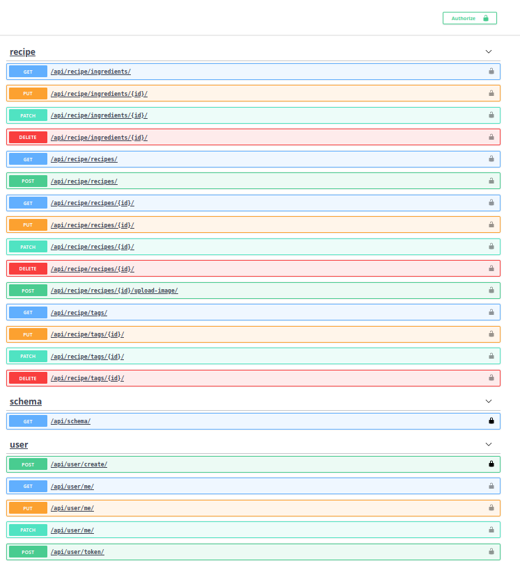

# Recipe API Project
This is a project created from the Udemy course **Build a Backend REST API with Python & Django** by Mark Winterbottom. 
As can be inferred from the title, Django serves as a backend API via which a user can create token, upload, and download data. 

The available interfaces are rendered via swagger as shown below: 

